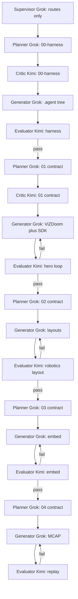

# COORDINATION — how agents work in this repository

Read `.agent/GOAL.md` first. This file governs *how* work runs. The supervisor routes. It does not implement and it does not grade. Every other role is spawned with a handoff packet and ends its run by appending to disk.

**Write to context, not to chat.** The knowledge graph, contracts, progress, and logs are how agents share state. A run whose only output is a chat paragraph has produced nothing.

## Allowed models

This is a cheap side project. The Task tool `model` field must be one of these two slugs, spelled exactly:

| Role | Model slug | Forbidden |
|---|---|---|
| Supervisor | `cursor-grok-4.6-high-fast` (this session) | Implementing any deliverable; grading any deliverable |
| Planner | `cursor-grok-4.6-high-fast` | Writing product code; grading its own contract |
| Contract critic | `kimi-k3-high` | Writing the contract it attacks; rubber-stamping vague criteria |
| Generator | `cursor-grok-4.6-high-fast` | Grading its own diff; ticking contract checkboxes; editing the contract |
| Evaluator | `kimi-k3-high` | Fixing the code it is grading; passing an item it did not mechanically check |
| KG librarian | `cursor-grok-4.6-high-fast` | Inventing decisions; rewriting graph lines in place |

**Banned slugs (hard fail of the spawn):** `claude-opus-5-thinking-high`, `gpt-5.6-sol-medium`, `composer-2.5-fast`, `inherit`.

`inherit` is banned because it silently follows whatever parent model the human picked. Always pass the slug.

Cavecrew investigator / reviewer, when used, must also pass one of the two allowed slugs. Investigator is read-only. Reviewer does not write product code.

## Producer ≠ judge

An agent must never both produce a deliverable and grade it. Generators are Grok. Critics and evaluators are Kimi K3. That split is `dec_producer_neq_judge`.

Corollaries:

- The planner that wrote a contract may not generate against it.
- The generator may not tick a single `- [ ]` in any contract. Checkboxes are evaluator-only ink.
- The critic that attacked a contract may not then author it. It returns amendments; the planner applies them.
- The evaluator may not fix anything. It grades and returns.

## Handoff packet

Every spawn carries exactly these four fields. A spawn missing any of them is malformed and the sub-agent should refuse it.

1. **Contract item IDs** — the specific ids this run owns, never "the whole contract".
2. **Exact files to touch, as `path:line` pointers** — not pasted file bodies.
3. **Success criteria** — a mechanical check a different model can reproduce from a clean shell.
4. **Do-not list** — the role's Forbidden column plus the contract's out-of-scope section.

Also pass `model` as the slug from the table above. Example:

```text
Role:        Generator (01-hero-loop)
Model:       cursor-grok-4.6-high-fast
Contract:    .agent/workstreams/01-hero-loop/contract.md, items HL-01…HL-N
Files:       <path:line pointers>
Success:     the smoke command in that contract exits 0 from $ROOT
Do not:      tick contract checkboxes; write embed UI; add MCAP; spawn any model other than the two allowed slugs
```

## Phase DAG



Planners for later phases may draft contracts in parallel **only after** the harness evaluates pass, and only into their own `contract.md`. Product-code generators never parallelize: they share the Python package and the layout files.

`05-stunt-extras` is not on this DAG until `cap_live_ws_camera_teleop`, `cap_3d_map_hud`, and `cap_embed_page` are `done`.

## Gate, stop, restart, escalate

1. **Critic gate.** No generator starts until the Kimi critic and the Grok planner agree. Vague criteria ("looks correct", "playable", "good demo") are rejected. A generator handed an ungated contract refuses the spawn.
2. **Adversarial eval.** The Kimi evaluator is told the work is broken and must prove it. Proving means: **run** the smoke command from a clean shell, read the diff, and tick every contract item id with command output or exact quoted file text. "Looks fine" is a fail. An unrun check is a fail.
3. **Restart, never archaeology.** A failed attempt is restarted against the contract, not patched until it resembles the contract.
4. **Escalate only on a wrong contract.** Escalate to the human only when a locked decision is wrong or the contract cannot be satisfied as written. Never escalate merely because an attempt failed.

## Append-only last action

Every agent's final action is append-only and is two things: exactly one new `log.md` entry in its workstream, **and** any new knowledge-graph triples appended to `nodes.jsonl` / `edges.jsonl`. Nothing existing is rewritten in place.

Log entry format:

```text
## [YYYY-MM-DD] op | title
```

`op` is one of: `supervisor`, `planner`, `critic`, `generator`, `evaluator`, `librarian`, `loop`. Newest at the bottom. Dates never decrease down the file.

Do not summarize the graph in chat. Point at the files.

## Resume

Any agent resumes from disk alone. Read in this order:

1. `.agent/GOAL.md`
2. The relevant `.agent/workstreams/<nn>-<name>/contract.md` plus its `progress.md` and, for product phases, `PLAN.md`
3. `.agent/knowledge-graph/nodes.jsonl` and `edges.jsonl`, with `SCHEMA.md` for queries

Then, as needed:

4. `.agent/COORDINATION.md` (this file)
5. That workstream's `log.md` and `eval.md` if present

**Do not read the chat transcript.** If an answer is not on disk, write it down.

**Split rule.** If a workstream's state cannot fit in `PLAN.md` / `contract.md` / `progress.md` / `log.md`, split it.

## Harness self-check

From the repository root (`/Users/michael/Documents/foxglove/work/doom`):

```sh
python3 .agent/knowledge-graph/validate.py --harness && echo "HARNESS OK"
```

Graph-only:

```sh
python3 .agent/knowledge-graph/validate.py
```
