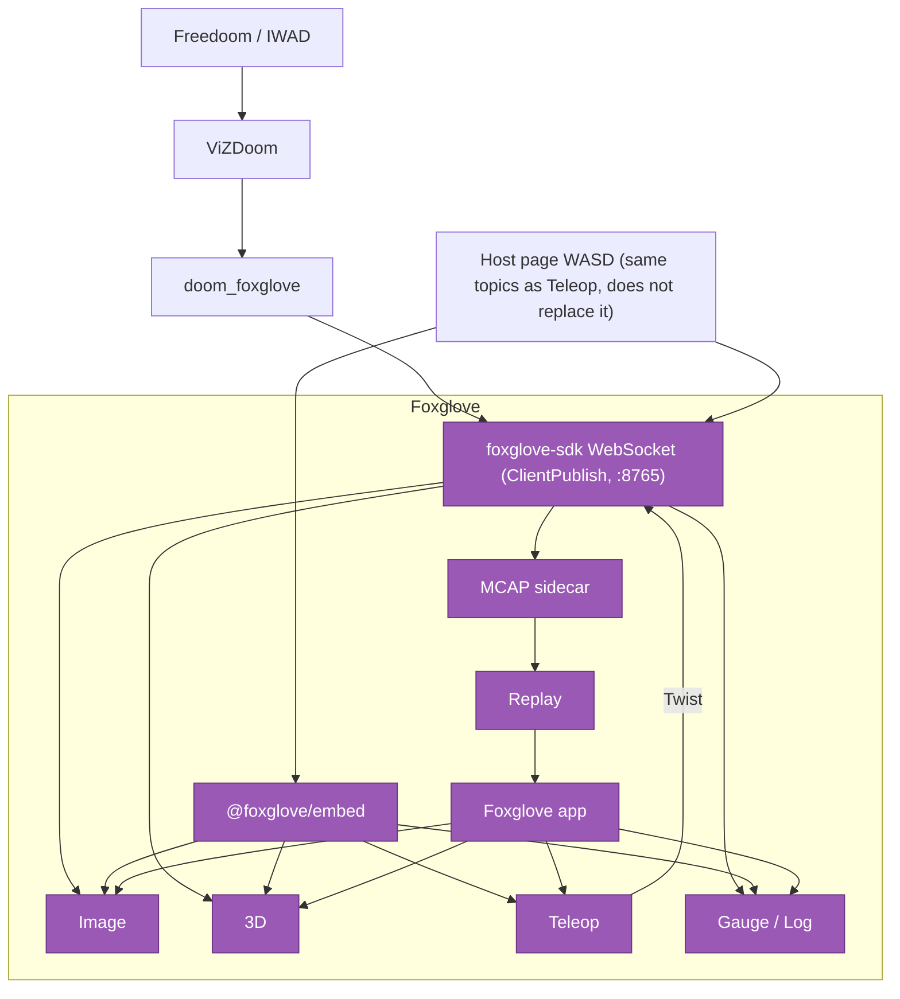

# Foxglove DOOM

Foxglove already teleoperates robots. This repo is a stunt that treats a DOOM marine as that robot. If the marine's camera is a stock Foxglove Image panel and Teleop publishes Twist, the stunt worked. If someone draws the game on a host canvas, it failed. This repo does not draw the game in a host canvas.



## Run

Python 3.12 and `uv`, from the repository root:

```sh
uv venv --python 3.12 .venv
source .venv/bin/activate
uv pip install foxglove-sdk pillow numpy vizdoom
./smoke
```

`./smoke` boots the WebSocket, publishes a JPEG on `/doom/camera`, and accepts Twist on `/cmd_vel`. Skip the Freedoom download with `./smoke --no-fetch-iwad`.

Play it:

```sh
PYTHONPATH=. python -m doom_foxglove --fetch-iwad
```

In a second terminal: `cd web && npm install --no-audit --no-fund && npm run dev`, then open [http://localhost:5173/](http://localhost:5173/). Image shows `/doom/camera`; Teleop on `/cmd_vel` drives the marine; fire and use go on `/doom/buttons`. The Foxglove app can attach the same way: Foxglove WebSocket at `ws://localhost:8765` (`ClientPublish` is on). Live runs also write `recordings/doom-<utc-timestamp>.mcap` (`--no-record` skips it; `--recording path.mcap` picks the path).

Without `uv`: `python3.12 -m venv .venv`, then `pip install -r requirements.txt` and `pip install vizdoom`.

Use Freedoom (`freedoom1.wad` for E1M1) or shareware `doom1.wad`. Do not copy a commercial doom.wad / doom2.wad into this tree. Smoke fetches official Freedoom 0.13.0 into `wad/freedoom1.wad` when none is found; `DOOM_IWAD` also works.

The embed's Play and Debug buttons load `layouts/Play.json` and `layouts/Debug.json` as programmatic trees — do not import those two into the Foxglove app. WASD on the host page publishes the same topics as Teleop; see `web/README.md`.

## Replay an MCAP

Headless proof from the repository root:

```sh
./smoke-replay
```

That writes `recordings/smoke.mcap`. In the Foxglove app (or https://app.foxglove.dev as a local-file viewer): **File → Open local file** (or drag the `.mcap` onto the window), import `layouts/Replay.json`, and use the playback bar. There is no cloud share link in v1.

`./smoke-events` writes `recordings/smoke-events.mcap` with tagged `/doom/events` (`death`, `weapon`, `level`, `pickup`). Replay already shows `/doom/log`; add Raw Messages on `/doom/events` if you want to scrub by `kind`.

## Ask Foxglove (copy-paste)

No custom agent ships in this repo. Open a recording (`recordings/doom-*.mcap` or `recordings/smoke-events.mcap`) in the Foxglove app with `layouts/Replay.json`, then paste one of these into the built-in agent / MCP box.

**When did health drop?**

```
Using /doom/player.health, /doom/events (kind=pickup or death), and /doom/log, when did health drop, and what happened in the two seconds before each drop? Give timestamps I can scrub to.
```

**Why did I die?**

```
Find /doom/events where kind=death (and the matching /doom/log line). Using /doom/player, /doom/entities, and health/ammo around that timestamp, why did I die? Point me at the scrub time.
```

**Build a layout for weapons**

```
Build a Foxglove layout that plots /doom/player.weapon and /doom/player.ammo vs time, shows /doom/events filtered to kind=weapon, keeps the Image panel on /doom/camera, and leaves Teleop hidden for replay.
```

Use these in the Foxglove app against a Replay MCAP. The embed page does not include an agent.

## Not in this slice

This slice stays on one machine and one playthrough. It does not include a remote-access gateway, a comparison mode UI, cloud share links, or ViZDoom policy vs human. Map-panel GPS fakery, audio, and mouse-look stay out.

## Build notes

ViZDoom wheels cover Python 3.10–3.13. The commands above use a 3.12 venv because system 3.14 on this Mac may not have a wheel. On macOS, if `pip install vizdoom` starts a source build:

```sh
brew install cmake boost sdl2 openal-soft
pip install vizdoom
```

If ViZDoom cannot import or `game.init()` fails, the server still comes up and smoke still exits 0 using a labeled 320x200 framebuffer on the same `/doom/camera` topic. That fallback is a CompressedImage, not a canvas. Prefer fixing the ViZDoom install.

`./smoke` and `./smoke-replay` bind an ephemeral port when `8765` is already taken, print the bound URL, and still exit 0. `python -m doom_foxglove` still defaults to 8765 and fails loudly if that port is occupied. Bind another port and point the embed at it:

```sh
PYTHONPATH=. python -m doom_foxglove --fetch-iwad --port 8766
# then open http://localhost:5173/?ws=ws://localhost:8766
```

Equivalent smoke: `PYTHONPATH=. .venv/bin/python -m doom_foxglove.smoke`. Headless embed check: `./web/check`. Regenerate layout JSON with `PYTHONPATH=. python -m doom_foxglove.layouts_export`.
